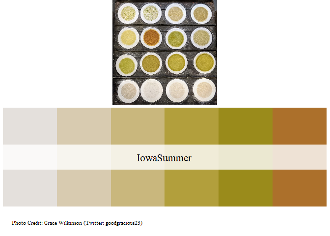
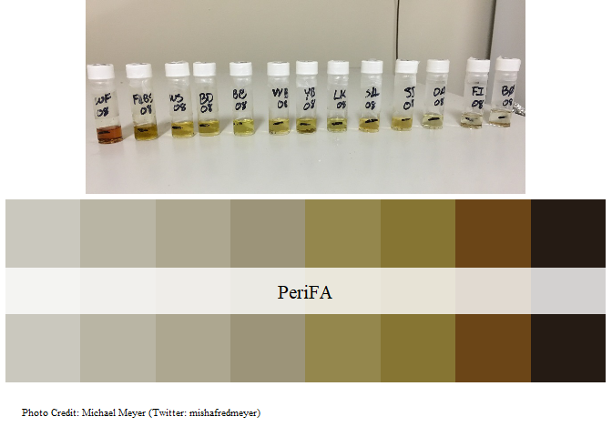
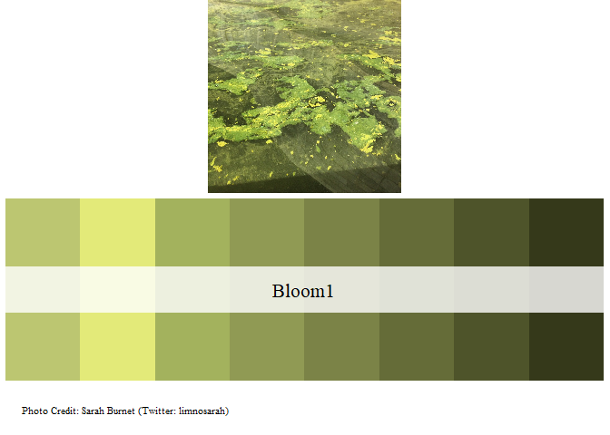
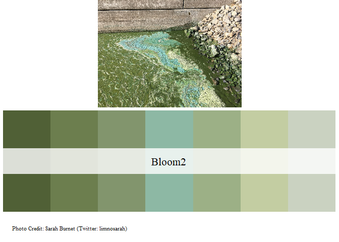
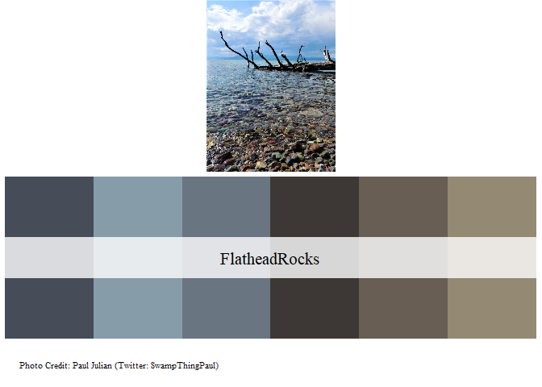
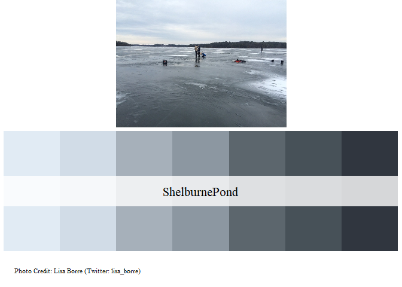

LimnoPalettes
================

## Table of Contents

  - [Citing package](#cite)
  - [Installation](#install)
  - [Examples](#examp)

Code and general idea inspired by the [“Wes Anderson
Palettes”](https://github.com/karthik/wesanderson) R-Package.

## Citing package <a name="cite"></a>

``` r
citation('LimnoPalettes')
```

    ## 
    ## To cite package 'LimnoPalettes' in publications use:
    ## 
    ##   Paul Julian (2020). LimnoPalettes: A Limnology themed Palette
    ##   Generator. R package version 0.1.0.
    ##   https://github.com/SwampThingPaul/LimnoPalettes
    ## 
    ## A BibTeX entry for LaTeX users is
    ## 
    ##   @Manual{,
    ##     title = {LimnoPalettes: A Limnology themed Palette Generator},
    ##     author = {Paul Julian},
    ##     year = {2020},
    ##     note = {R package version 0.1.0},
    ##     url = {https://github.com/SwampThingPaul/LimnoPalettes},
    ##   }

## Installation <a name="install"></a>

``` r
install.packages("devtools");# if you do not have it installed on your PC
devtools::install_github("SwampThingPaul/LimnoPalettes")
```

## Now Presenting… <a name="examp"></a>

<!-- -->

<!-- -->

<!-- -->

<!-- -->

<!-- -->

<!-- -->

<!-- -->

<!-- -->

<!-- -->

-----
