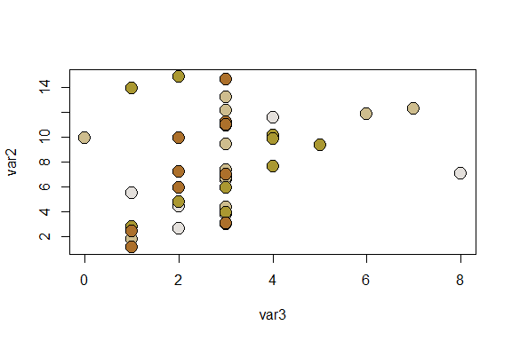

LimnoPalettes
================

## Table of Contents

  - [Citing package](#cite)
  - [Installation](#install)
  - [Palettes](#examp)
  - [Working Examples](#workexamp)

Code and general idea inspired by the [“Wes Anderson
Palettes”](https://github.com/karthik/wesanderson) R-Package.

## Citing package <a name="cite"></a>

``` r
citation('LimnoPalettes')
```

    ## 
    ## To cite package 'LimnoPalettes' in publications use:
    ## 
    ##   Paul Julian (2020). LimnoPalettes: A Limnology Themed Palette
    ##   Generator. R package version 0.1.1.
    ##   https://github.com/SwampThingPaul/LimnoPalettes
    ## 
    ## A BibTeX entry for LaTeX users is
    ## 
    ##   @Manual{,
    ##     title = {LimnoPalettes: A Limnology Themed Palette Generator},
    ##     author = {Paul Julian},
    ##     year = {2020},
    ##     note = {R package version 0.1.1},
    ##     url = {https://github.com/SwampThingPaul/LimnoPalettes},
    ##   }

## Installation <a name="install"></a>

Version `0.1.0` is offically on
[CRAN](https://cran.r-project.org/web/packages/LimnoPalettes/index.html)

``` r
install.packages("LimnoPalettes")
```

Development version can be installed from this repo.

``` r
install.packages("devtools");# if you do not have it installed on your PC
devtools::install_github("SwampThingPaul/LimnoPalettes")
```

## Now Presenting… <a name="examp"></a>

<!-- -->

<!-- -->

<!-- -->

<!-- -->

<!-- -->

<!-- -->

<!-- -->

<!-- -->

<!-- -->

<!-- -->

Image shared on [ABC Midwest and Wheatbelt Facebook
Page](https://www.facebook.com/abcmidwestandwheatbelt/photos/a.321716205984/10158416054510985/)

-----

## Working Examples. <a name="workexamp"></a>

``` r
set.seed(1)
dat = data.frame(Group=c(rep("A",10),rep("B",10),rep("C",10),rep("D",10)),
                  var1=rnorm(40),var2=runif(40,1,15),var3=rpois(40,3))

cols = limno_palette("SuperIce",4)
boxplot(var2~Group,dat, col=cols)
```

<!-- -->

``` r
cols = limno_palette("IowaSummer",4,"continuous")
cols2 = cols[dat$Group]
plot(var2~var3,dat,pch=21,bg=cols2,cex=2)
```

<!-- -->

``` r
cols = limno_palette("PeriFA",4,"continuous")
barplot(aggregate(dat$var3,list(dat$Group),mean)$x,names.arg=unique(dat$Group),ylim=c(0,4),col=cols)
```

<!-- -->

While not a part of this package, for data visualization purposes it
would be a good idea to see how these colors are perceived for people
with color blindness.

``` r
library(colorBlindness)
mat = matrix(1:81, nrow = 9, ncol = 9)

library(ggplot2)
library(reshape2)
cols = limno_palette("IowaSummer")

mat1 = melt(t(mat[9:1, ]))
len = length(cols)-1
mat1$v2 = cut(mat1$value,
              breaks = seq(0,ceiling(81/len)*len, 
                           length.out = len+1))
ht = ggplot(mat1) + 
  geom_tile(aes(x=Var1, y=Var2, fill=v2)) + 
  scale_fill_manual(values=cols) + 
  theme_bw()

# check the plot by CVD simulator
cvdPlot(ht)
```

<!-- -->

``` r
# Second Example
cols = limno_palette("Bloom2",10, "continuous")

mat1 = melt(t(mat[9:1, ]))
len = length(cols)-1
mat1$v2 = cut(mat1$value,
              breaks = seq(0,ceiling(81/len)*len, 
                           length.out = len+1))
ht = ggplot(mat1) + 
  geom_tile(aes(x=Var1, y=Var2, fill=v2)) + 
  scale_fill_manual(values=cols) + 
  theme_bw()

# check the plot by CVD simulator
cvdPlot(ht)
```

<!-- -->

-----
